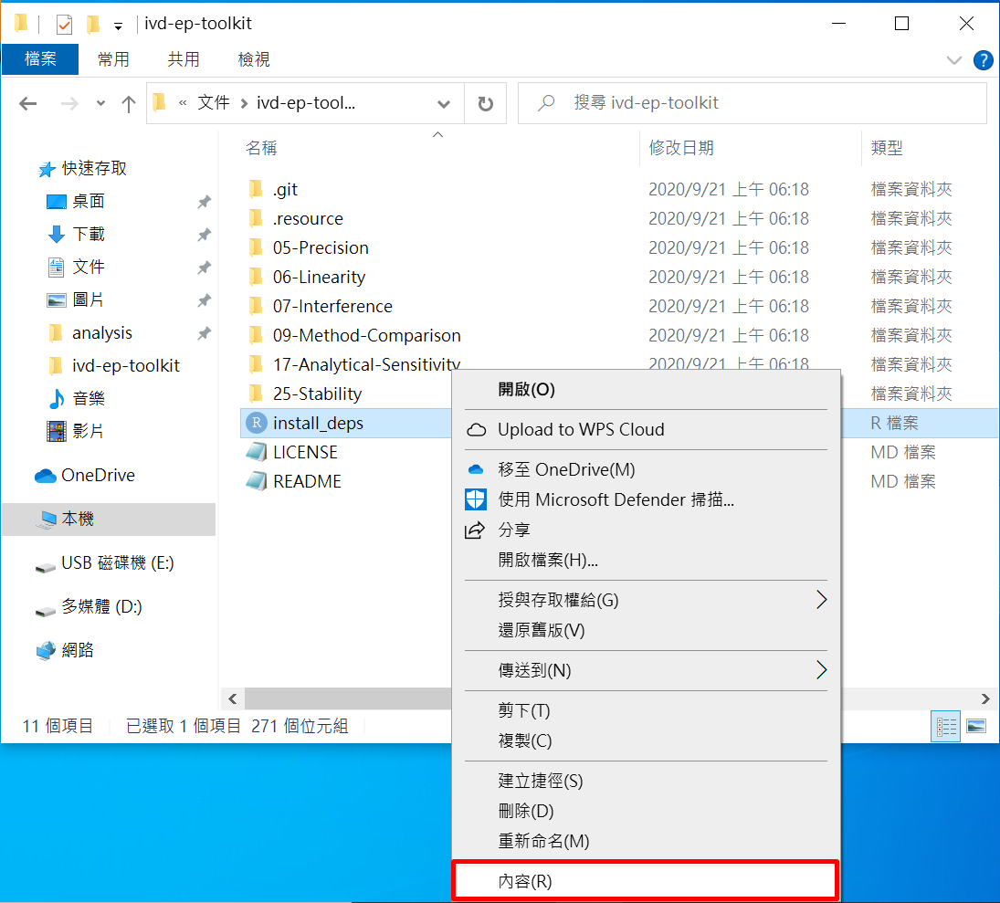
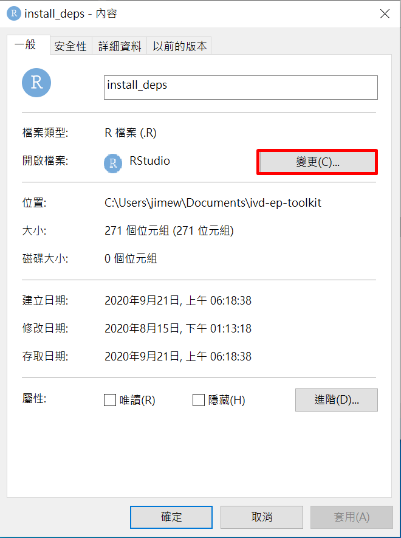
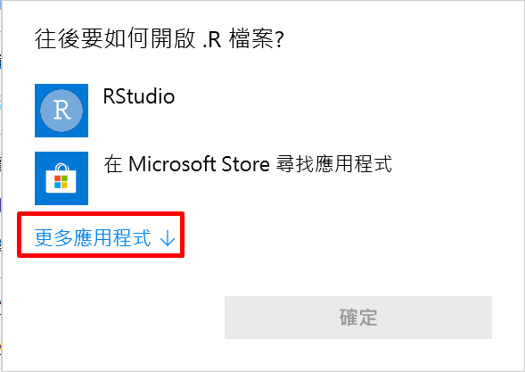
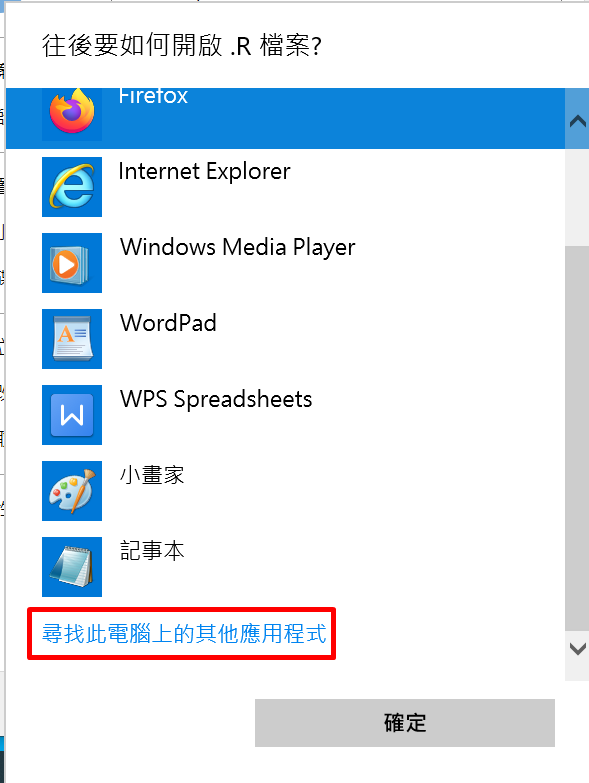
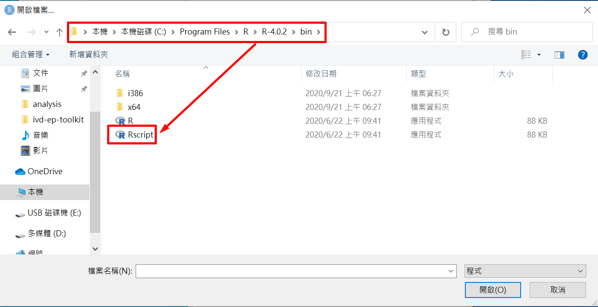
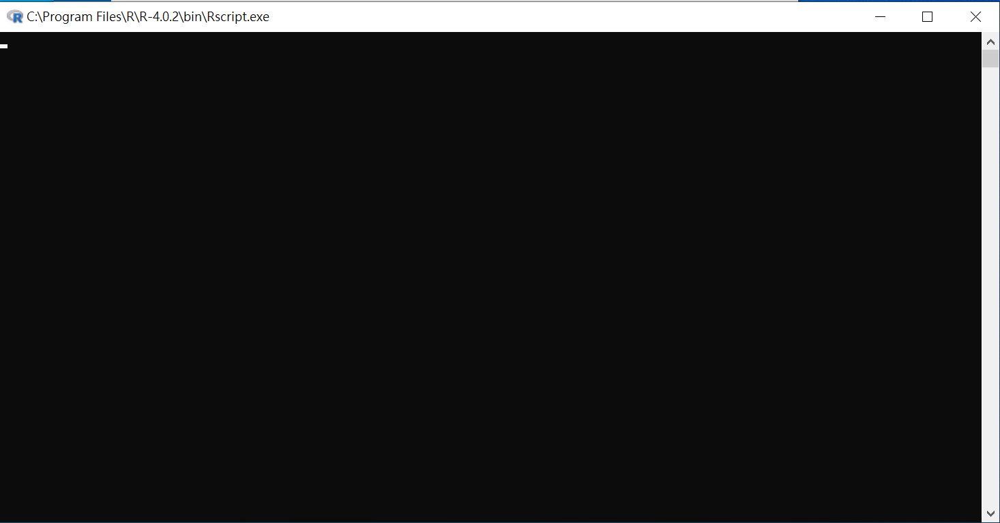

# 1. 初次使用

## 安裝R語言程式 (Windows)

- 前往[R語言官網](https://cloud.r-project.org/bin/windows/base/)
- 點擊網頁上最上方之下載連結，例如下圖:

- 下載後點擊安裝

## 下載ivd-ep-toolkit

- 前往[ivd-ep-toolkit頁面](https://github.com/jimewu/ivd-ep-toolkit/releases)
- 點擊下載最新版本之Source code的壓縮檔，如下圖:

- 解壓縮之後，將所得資料夾放在"本機/文件" (如果是舊版Windows則是"我的文件")裡面。如果資料夾名稱不是"ivd-ep-toolkit"(例如後方帶有版本數字)，則將資料夾重新命名為"ivd-ep-toolkit"即可。

## R語言程式安裝後設定 (Windows)

- 進入"ivd-ep-toolkit"，會看到一個install_deps.R，對其點擊右鍵並點擊"內容"，如下圖:

- 出現下圖畫面，點擊"變更"，如下圖:

- 出現下圖畫面，點擊"更多應用程式"，如下圖:

- 出現下圖畫面，捲到底並點擊"尋找此電腦上的其他應用程式"，如下圖:

- 出現下圖畫面，找到C槽下面的Program Files/R/R-4.0.2/bin，點擊"Rscript"並按下"開啟"，如下圖:

## 安裝程式所需套件

- 回到"ivd-ep-toolkit"，用滑鼠左鍵點擊install_deps.R兩次以執行，過程中會出現如下畫面:

- 完成後，即可開始使用各資料夾下的程式

# 2. 使用程式

- 依據要執行的程式，例如ep5-precision，則進入05-Precision資料夾
- 打開README.md (可以用記事本打開)閱讀說明，依照說明準備所需之setting.csv以及data.csv，放在程式資料夾中(example資料夾裡面有範例檔)，即可用左鍵點擊副檔名為".R"之程式執行。