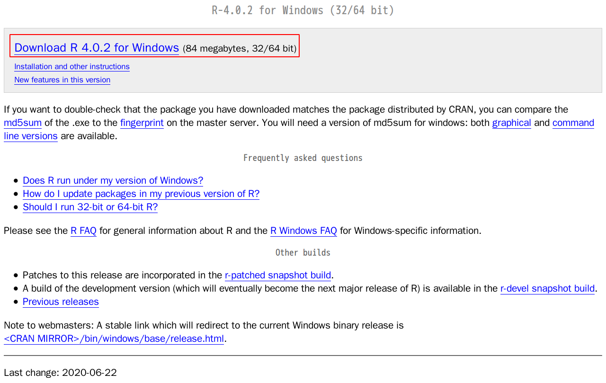
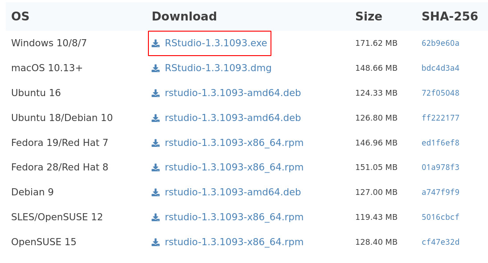
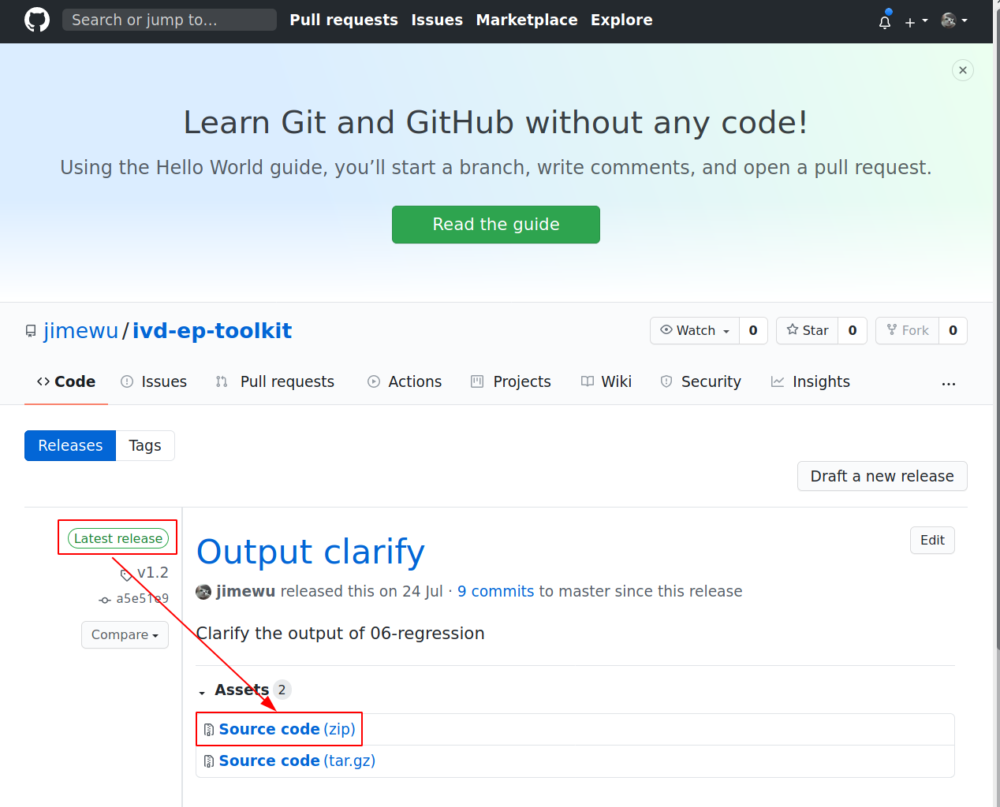
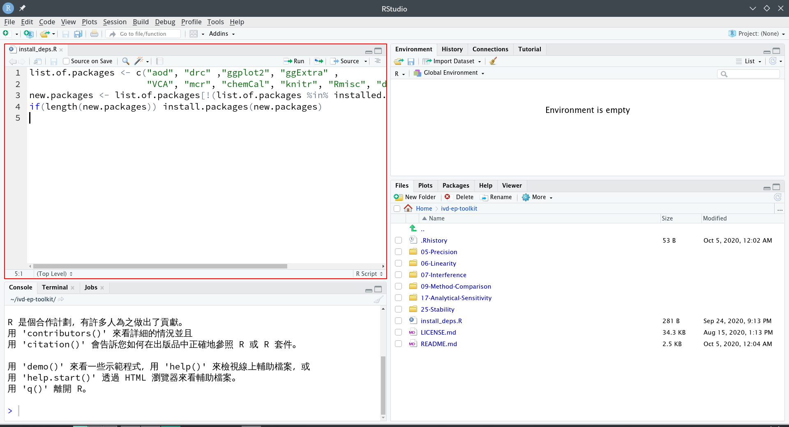
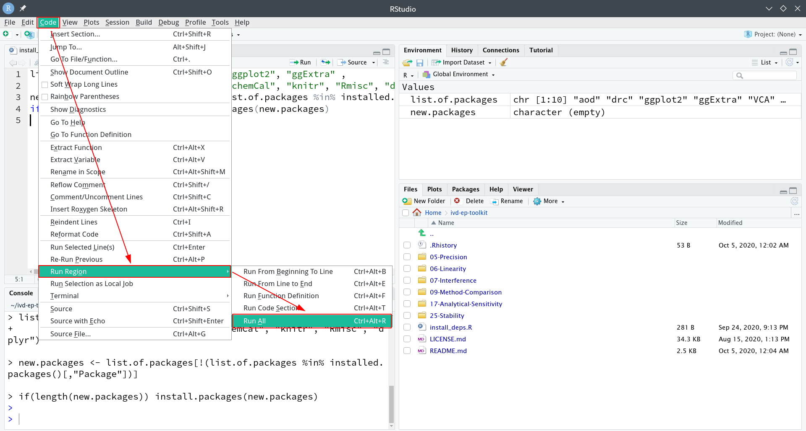

# 1. 初次使用

## 安裝R語言程式 (Windows)

- 前往[R語言官網](https://cloud.r-project.org/bin/windows/base/)
- 點擊網頁上最上方之下載連結，例如下圖:

- 下載後點擊安裝

## 安裝RStudio (Windows)

- 前往[RStudio官網](https://rstudio.com/products/rstudio/download/#download)
- 點擊網頁中Windows版本之下載連結，例如下圖:

- 下載後點擊安裝

## 下載ivd-ep-toolkit

- 前往[ivd-ep-toolkit頁面](https://github.com/jimewu/ivd-ep-toolkit/releases)
- 點擊下載最新版本之Source code的壓縮檔，如下圖:

- 解壓縮之後，將所得資料夾放在"本機/文件" (如果是舊版Windows則是"我的文件")裡面。如果資料夾名稱不是"ivd-ep-toolkit"(例如後方帶有版本數字)，則將資料夾重新命名為"ivd-ep-toolkit"即可。

## 安裝程式所需套件

- 進入"ivd-ep-toolkit"資料夾，並以RStudio打開資料夾中的"install_deps.R"命令稿，如下圖:

- 在RStudio程式選單中，選取"Code"->"Run Region"->"Run All"，如下圖:

- 點擊後即開始安裝。安裝套件耗時會依照電腦以及網路速度不同而定，可能需要10分鐘或更多。
- 結束之後，即可開始使用程式。

# 2. 使用程式

- 依據要執行的程式，例如ep5-precision，則進入05-Precision資料夾
- 打開README.md (可以用記事本打開)閱讀說明，依照說明準備所需之setting.csv以及data.csv，放在程式資料夾中(example資料夾裡面有範例檔)。
- 類似於前面"安裝程式所需套件"所描述，打開要執行之副檔名為".R"之程式，並在RStudio程式選單中，選取"Code"->"Run Region"->"Run All"，即可執行程式。