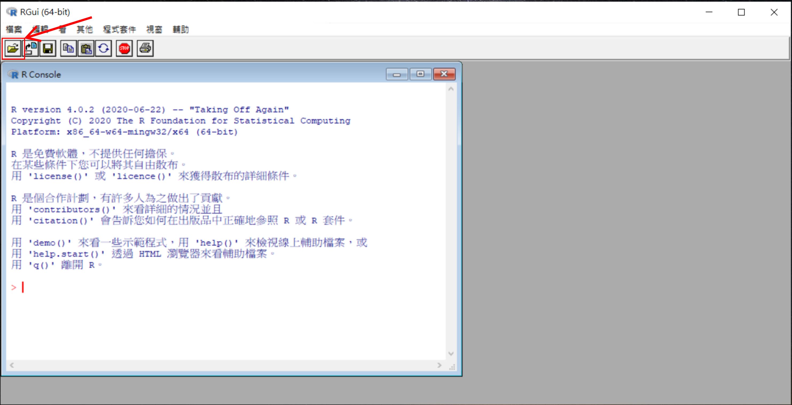
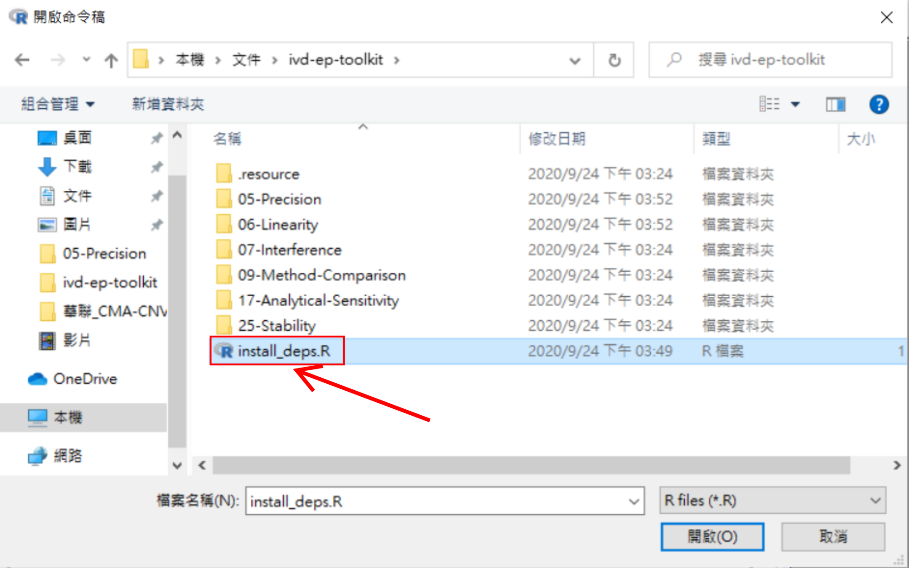
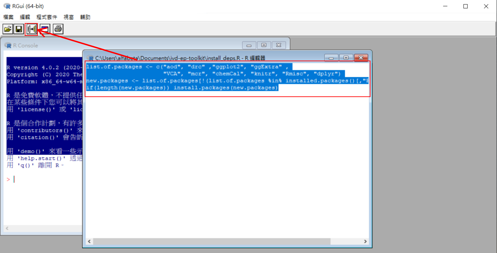
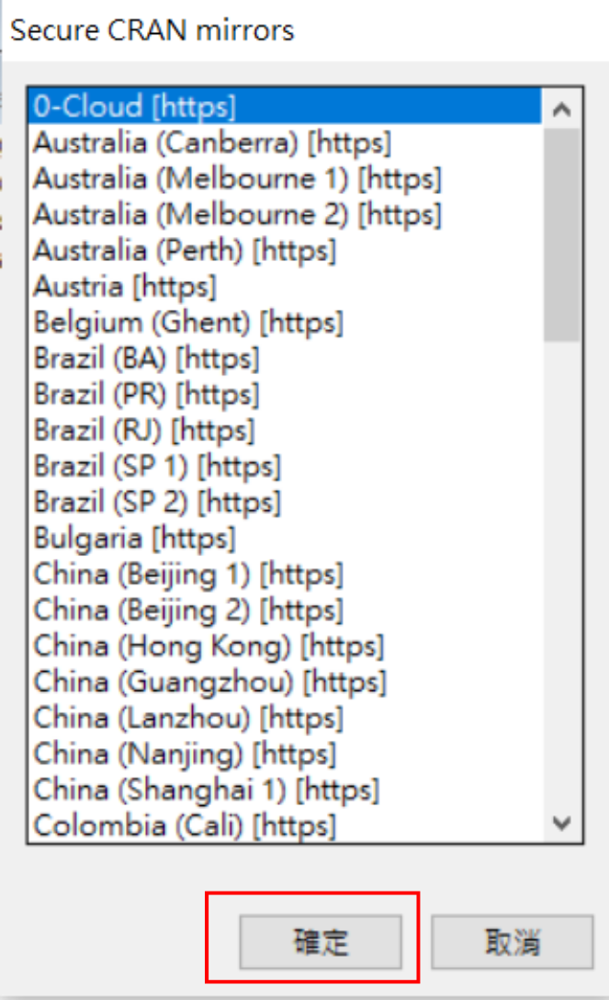
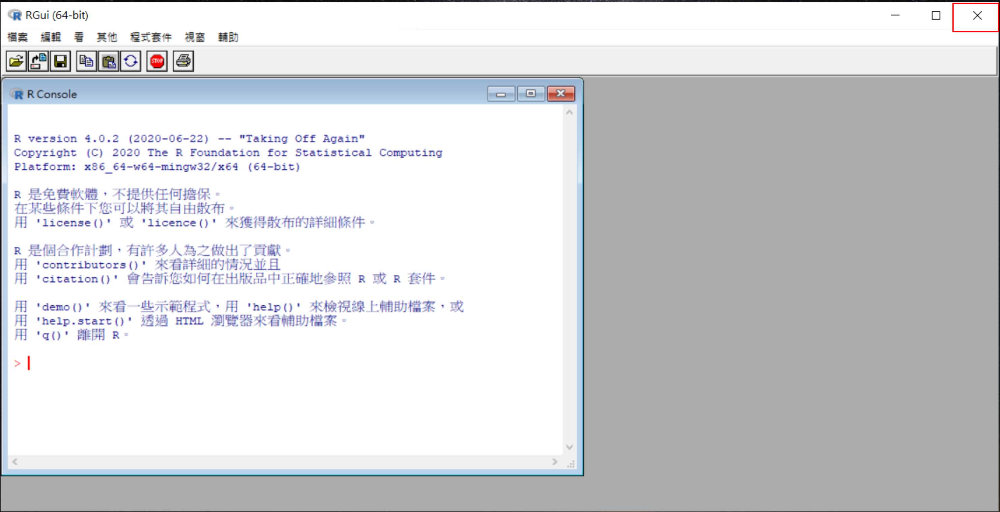
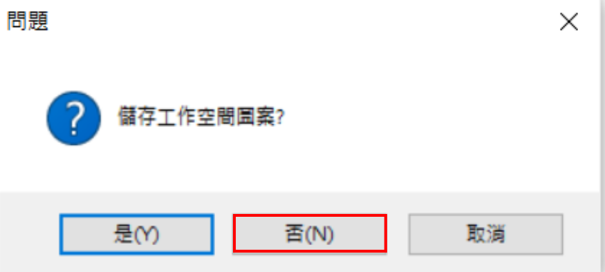

# 1. 初次使用

## 安裝R語言程式 (Windows)

- 前往[R語言官網](https://cloud.r-project.org/bin/windows/base/)
- 點擊網頁上最上方之下載連結，例如下圖:

- 下載後點擊安裝

## 下載ivd-ep-toolkit

- 前往[ivd-ep-toolkit頁面](https://github.com/jimewu/ivd-ep-toolkit/releases)
- 點擊下載最新版本之Source code的壓縮檔，如下圖:

- 解壓縮之後，將所得資料夾放在"本機/文件" (如果是舊版Windows則是"我的文件")裡面。如果資料夾名稱不是"ivd-ep-toolkit"(例如後方帶有版本數字)，則將資料夾重新命名為"ivd-ep-toolkit"即可。

## R語言程式安裝後設定 (Windows)

- 進入"ivd-ep-toolkit"，會看到一個install_deps.R，對其點擊右鍵並點擊"內容"，如下圖:

- 出現下圖畫面，點擊"變更"，如下圖:

- 出現下圖畫面，點擊"更多應用程式"，如下圖:

- 出現下圖畫面，捲到底並點擊"尋找此電腦上的其他應用程式"，如下圖:

- 出現下圖畫面，找到C槽下面的Program Files/R/R-4.0.2/bin，點擊"Rscript"並按下"開啟"，如下圖:

## 安裝程式所需套件

- 打開資料夾，進入C槽下面的Program Files/R/R-4.0.2/bin/x64，裡面會有一個Rgui.exe如下圖:

(如果使用32位元Windows，則上述路徑改為C槽下面的Program Files/R/R-4.0.2/bin/i386，大多數人應該都不是此狀況)

- 打開Rgui.exe之後，點擊左上方第一個開啟檔案圖示，如下圖:

- 會出現"開啟命令稿"視窗，選擇"文件/ivd-ep-toolkit"底下的"install_deps.R"命令稿，如下圖:

- 打開"install_deps.R"命令稿之後，會多出現一個新的視窗顯示其內容，將其內容文字全部選取，然後再點擊左上方第3個圖示，如下圖:

- 過程中會詢問要從哪一個來源(鏡像)下載套件，直接點確定即可開始安裝，如下圖:

安裝套件耗時會依照電腦以及網路速度不同而定，可能需要10分鐘或更多，結束之後，關閉Rgui.exe即完成套件安裝，如下圖:

# 2. 使用程式

- 依據要執行的程式，例如ep5-precision，則進入05-Precision資料夾
- 打開README.md (可以用記事本打開)閱讀說明，依照說明準備所需之setting.csv以及data.csv，放在程式資料夾中(example資料夾裡面有範例檔)，即可用左鍵點擊副檔名為".R"之程式執行。